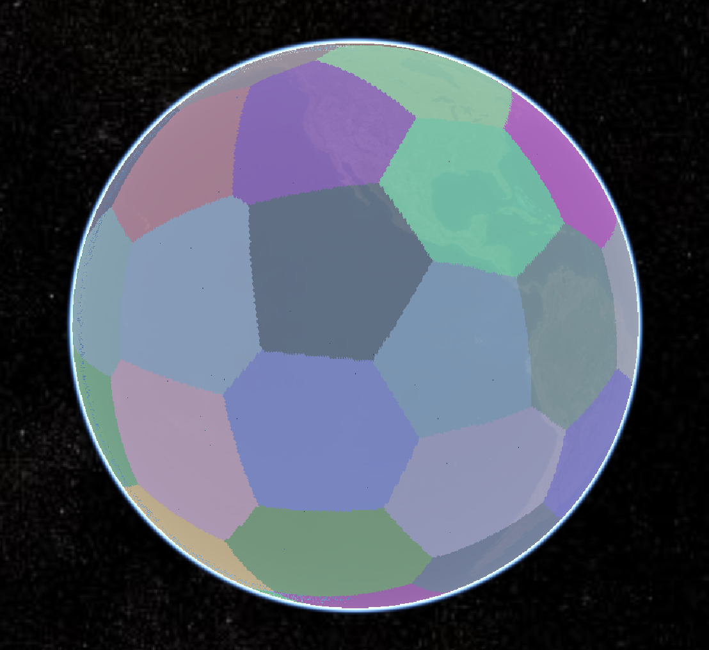

# An algorithm using edge attribution and bilateral scanning to generate spherical raster Voronoi diagrams

&emsp;&emsp;球面`Voronoi`图是计算几何中的重要研究方向，生成算法是关键技术。现有的球面栅格算法多是由平面算法扩展而来，符合计算机的离散特征，但在海量数据处理时效率不高。为解决这个问题，提出了一种结合边缘归属与双向扫描的球面`Voronoi`图生成算法。

&emsp;该算法的核心是利用邻近格网的`Voronoi`属性传递，来减少格网的确定归属计算次数，以此达到提高效率的目的。实验结果表明，这种算法具有与确定归属算法相同的精度，但计算量减少了80%以上，效率提高了四倍以上。此外，随着划分的格网数量增加，算法的优势更加明显。

## 目录

```
|--plane
  |--img
  |--centroid_voronoi.py
  |--pane_voronoi.py
|--sphere
  |--Cesium
  |--img
  |--data
  |--Latitude.py
  |--Longitude.py
  |--symmetry.py
  |--run.py
  |--convert_la.py
  |--centroid_run.py
  |--Voronoi_SP.html
|--requirements.txt
|--readme.md
```

## 介绍

- `plane`：这个目录下存放平面质心`Voronoi`图的生成算法，如果不想生成质心`Voronoi`图，那只需要把迭代次数设置为`1`即可。
- `sphere`：这个目录下存放球面质心`Voronoi`图的生成算法，如果不想生成质心`Voronoi`图，那只需要把迭代次数设置为`1`即可。
- `sphere/img` or `plane/img`：这个目录下存放生成的`Voronoi`图。
- `sphere/latitude.py`：将平面笛卡尔坐标转换为经纬度坐标得到纬度值。
- `sphere/longitude.py`：将平面笛卡尔坐标转换为经纬度坐标得到经度值。
- `sphere/symmetry.py`：南半球的坐标与北半球对称排列。
- `sphere/run.py`：生成球形`Voronoi`图的核心算法，运行这个`python`文件会得到一个二维数组，这个数组存储了`Voronoi`区域中所有点的归属信息。
- `sphere/centroid_run.py`：生成球形质心`Voronoi`图的核心算法，运行这个`python`文件会得到一个二维数组，这个数组存储了`Voronoi`区域中所有点的归属信息。
- `sphere/convert_la.py`：将球面笛卡尔坐标转换为经纬度坐标。
- `sphere/Voronoi.html`用于球面Voronoi的展示，需要配合`VScode`的中`Live Serve`插件使用。
- `sphere/data`：这个目录用于存放可供`Cesium`使用的`json`文件。

## Todo

- [x] 平面Voronoi图生成
- [x] 平面质心Voronoi图生成
- [x] 球面Voronoi图生成
- [x] 球面质心Voronoi图生成
- [x] 利用Cesium展示球面Voronoi图
- [ ] 利用世界人口密度数据生成球面质心Voronoi图
- [ ] 给定任意密度图，生成球面质心Voronoi图

## 快速开始

- 克隆仓库

`git clone https://github.com/KMnO4-zx/voronoi-algorithm.git`

- 切换工作目录

`cd voronoi-algorithm`

- 安装依赖

`pip install -r requirements.txt`

- 如果要获取平面`Voronoi`图，需要运行`plane`目录下的`centroid_voronoi.py`文件。需要更改以下参数：

```python
n = 800 # 边长
step = 25 # 质心迭代次数
seed_num = 32 # 种子点个数
```

> 注：如果只想获取平面`Voronoi`图，将`step`设置为`1`即可。下图为`step=25`的结果。

<div align=center>
  
</div>


-  如果要获取球面`Voronoi`图，需要运行`sphere`目录下的`centroid_run.py`文件。需要更改以下参数：

```python
n = 10 # 层数
size = 2 ** n + 1 # 边长
seed_num = 12 # 种子点数量
step = 25 # 质心迭代次数
```

> 注：如果只想获取球面`Voronoi`图，将`step`设置为`1`即可。下图为`step=25`的结果。
>
> 

<div align=center>
  
</div>


- 球面`Cesium`展示，此为`seed_num=50, step=25`的结果。可以看出球面上的`Voornoi`区域都比较均匀。

<div align=center>
  
</div>

## 引用

如果您觉得我的工作对您有帮助，请考虑引用下列论文~

```
@article{{0},
  author = {Wang Lei, Song Zhixue, Yin Nan &amp; Cheng Gang},
  title = {A Raster Voronoi Diagram Generating Algorithm Using Edge Attribution and Bilateral Scanning},
  journal = {Geomatics and Information Science of Wuhan University},
  volume = {},
  number = {},
  year = {},
  issn = {1671-8860},
  doi ={10.13203/j.whugis20220110}
}
```
