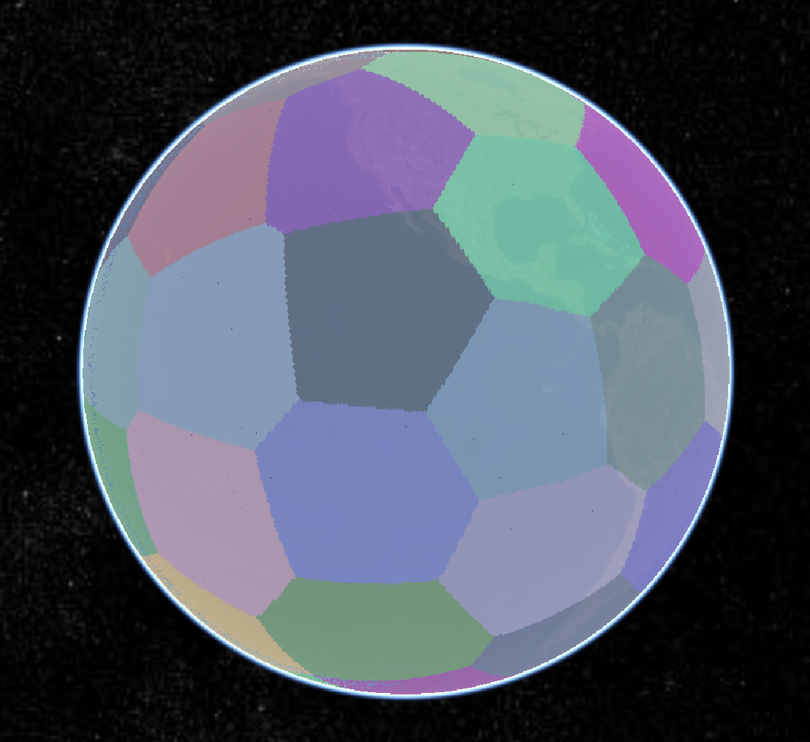

# An Algorithm Using Edge Attribution and Bilateral Scanning to Generate Spherical Raster Voronoi Diagrams

*中文阅读：[README](readme.md)*

&emsp;&emsp;Spherical Voronoi diagrams are an important research topic in computational geometry, and the generation algorithm is a key technique. Existing spherical raster algorithms are mostly extensions of planar algorithms that conform to the discrete nature of computers but are not efficient for processing massive data. To address this issue, an algorithm combining edge attribution and bilateral scanning is proposed for generating spherical Voronoi diagrams.

&emsp;&emsp;The core of this algorithm is to reduce the number of determination computations of grid ownership by utilizing the Voronoi attributes of neighboring grid cells, thereby improving efficiency. Experimental results show that this algorithm achieves the same accuracy as the deterministic ownership algorithm but reduces the computation by over 80% and improves efficiency by more than four times. Furthermore, as the number of divided grid cells increases, the advantages of the algorithm become more apparent.

## Directory

```
|--plane
  |--img
  |--centroid_voronoi.py
  |--pane_voronoi.py
|--sphere
  |--Cesium
  |--img
  |--data
  |--Latitude.py
  |--Longitude.py
  |--symmetry.py
  |--run.py
  |--convert_la.py
  |--centroid_run.py
  |--Voronoi_Primitive.html
  |--Voronoi_entities.html
  |--population.py
  |--population_centroid.py
  |--landscan-global-2021-colorized.tif
|--requirements.txt
|--readme.md
```

## Introduction

- `plane`: This directory contains the algorithm for generating planar centroid Voronoi diagrams. If you don't want to generate centroid Voronoi diagrams, you can set the number of iterations to 1.
- `sphere`: This directory contains the algorithm for generating spherical centroid Voronoi diagrams. If you don't want to generate centroid Voronoi diagrams, you can set the number of iterations to 1.
- `sphere/img` or `plane/img`: This directory contains the generated Voronoi diagrams.
- `sphere/latitude.py`: Converts Cartesian coordinates to latitude values for spherical coordinates.
- `sphere/longitude.py`: Converts Cartesian coordinates to longitude values for spherical coordinates.
- `sphere/symmetry.py`: Arranges the coordinates in the southern hemisphere symmetrically to the northern hemisphere.
- `sphere/run.py`: The core algorithm for generating spherical Voronoi diagrams. Running this Python file will generate a 2D array that stores the ownership information of all points in the Voronoi regions.
- `sphere/centroid_run.py`: The core algorithm for generating spherical centroid Voronoi diagrams. Running this Python file will generate a 2D array that stores the ownership information of all points in the Voronoi regions.
- `sphere/convert_la.py`: Converts spherical Cartesian coordinates to latitude and longitude coordinates.
- `sphere/Voronoi_entities.html`: Used to display spherical Voronoi diagrams using the "entities" method. It needs to be used with the "Live Serve" plugin in VScode.
- `sphere/Voronoi_Primitive.html`: Used to display spherical Voronoi diagrams using the "Primitive" method (more efficient). It needs to be used with the "Live Serve" plugin in VScode.
- `sphere/data`: This directory is used to store the JSON files for use with Cesium.
- `sphere/landscan-global-2021-colorized.tif`: This file contains global population density data. Data source: [LandScan Global 2021](https://landscan.ornl.gov).

> Note: To generate spherical centroid Voronoi diagrams using world population data, you need to install the GDAL library. It is recommended to install it using conda: `conda install -c conda-forge gdal`. If that doesn't work, you can try downloading the GDAL wheel file and installing it using pip. 

## Todo

- [x] Planar Voronoi diagram generation
- [x] Planar centroid Voronoi diagram generation
- [x] Spherical Voronoi diagram generation
- [x] Spherical centroid Voronoi diagram generation
- [x] Displaying spherical Voronoi diagrams using Cesium
- [x] Generating spherical centroid Voronoi diagrams using world population density data
- [x] Loading spherical Voronoi diagrams using Cesium's "Primitive" method

## Quick Start

- Clone the repository:

`git clone https://github.com/KMnO4-zx/voronoi-algorithm.git`

- Change to the working directory:

`cd voronoi-algorithm`

- Install the dependencies:

`pip install -r requirements.txt`

- To generate planar Voronoi diagrams, run the `centroid_voronoi.py` file in the `plane` directory. Modify the following parameters:

```python
n = 800 # side length
step = 25 # centroid iteration count
seed_num = 32 # number of seed points
```

> Note: If you only want to generate planar Voronoi diagrams, set `step` to 1. The image below shows the result with `step=25`.

<div align=center>
  
</div>


- To generate spherical Voronoi diagrams, run the `centroid_run.py` file in the `sphere` directory. Modify the following parameters:

```python
n = 10 # number of layers
size = 2 ** n + 1 # side length
seed_num = 12 # number of seed points
step = 25 # centroid iteration count
```

> Note: If you only want to generate spherical Voronoi diagrams, set `step` to 1. The image below shows the result with `step=25`.

<div align=center>
  
</div>


- Display spherical centroid Voronoi diagrams using Cesium. The image below shows the result with `seed_num=50` and `step=25`. The Voronoi regions on the sphere appear relatively uniform.

<div align=center>
  
</div>

- Display spherical centroid Voronoi diagrams using Cesium (with population density data). The image below shows the result with `seed_num=168` and `step=64`. The Voronoi regions in the ocean areas are larger, while the regions in the land areas are smaller.

<div align=center>
  
</div>

## Citation

If you find my work helpful, please consider citing the following paper:

```latex
@article{{0},
  author = {Wang Lei, Song Zhixue, Yin Nan &amp; Cheng Gang},
  title = {A Raster Voronoi Diagram Generating Algorithm Using Edge Attribution and Bilateral Scanning},
  journal = {Geomatics and Information Science of Wuhan University},
  volume = {},
  number = {},
  year = {},
  issn = {1671-8860},
  doi ={10.13203/j.whugis20220110}
}
```

